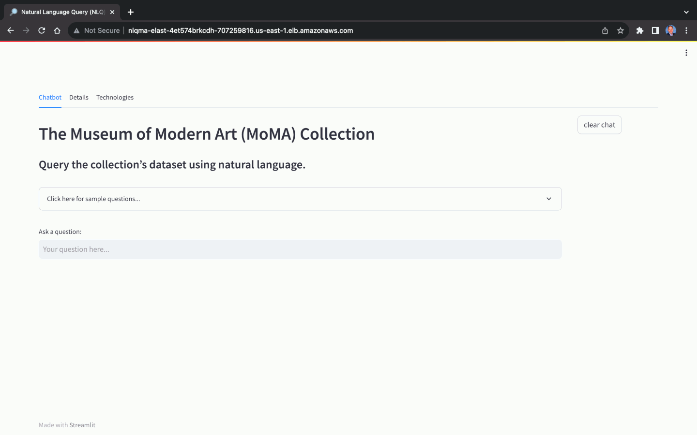

## Guidance for Natural Language Queries of Relational Databases on AWS

This AWS Solution contains a demonstration of Generative AI, specifically, the use of Natural Language Query (NLQ) to ask questions of an Amazon RDS for PostgreSQL database. The solution has options to use Amazon SageMaker JumpStart Foundation Models, Amazon Bedrock, or OpenAI. The demonstration's web-based application, running on Amazon ECS on AWS Fargate, uses a combination of [LangChain](https://python.langchain.com/docs/get_started/introduction.html), [Streamlit](https://streamlit.io/), [Chroma](https://www.trychroma.com/) open-source embedding database, and [HuggingFace SentenceTransformers](https://huggingface.co/sentence-transformers) to create sentence embeddings. The application accepts natural language questions from an end-users and returns natural language answers, along with the associated SQL query and Pandas DataFrame-compatible result set.

#### NLQ Application Chatbot Preview



## Foundation Model Choice and Accuracy of NLQ

The selection of the Foundation Model (FM) for Natural Language Query (NLQ) plays a crucial role in the application's ability to accurately translate natural language questions into natural language answers. Not all FMs are capable of performing NLQ. In addition to model choice, NLQ accuracy also relies heavily on factors such as the quality of the prompt, prompt template, labeled sample queries used for in-context learning (_aka few-shot prompting_), and the naming conventions used for your database schema (tables and columns).

The NLQ Application was tested on a variety of open source and commercial FMs. As a baseline both Anthropic Claude v1.3 and v2, and OpenAI's GPT-3 and GPT-4 series models were capable of accurately answering most or all sample questions included in this README file and the NLQ Application's web UI. Anthropic's Claude-series models, including `anthropic.claude-v1` and `anthropic.claude-v2`, as well as OpenAI's Generative Pre-trained Transformer GPT-3 and GPT-4 series models, including `text-davinci-003` (Legacy), `gpt-3.5-turbo`, and `gpt-4`, all provide accurate responses to a wide range of complex natural language queries using an average amount of in-context learning and prompt engineering.

Open source NLQ-capable models, such as `google/flan-t5-xxl` and `google/flan-t5-xxl-fp16` (half-precision floating-point format (FP16) version of the full model), are available through Amazon SageMaker JumpStart Foundation Models. While the `google/flan-t5` series of models are a popular choice for building Generative AI applications, their capabilities for NLQ are limited compared to other commercial LLMs. The demonstration's `google/flan-t5-xxl-fp16` is capable of answering basic natural language queries with sufficient in-context learning, but will fail to return an answer, provide incorrect answers, or cause the model endpoint to experience timeouts due to resource exhaustion when faced with moderate to complex questions. Users are encouraged to experiment with a variety of open source and commercial JumpStart Foundation Models, and Amazon Bedrock when available, for best results.

### Option 1: Switching JumpStart Foundation Models

You can replace the default `google/flan-t5-xxl-fp16` JumpStart Foundation Model, deployed using the `NlqSageMakerEndpointStack.yaml` CloudFormation template file. You will first need to modify the model parameters in the `NlqSageMakerEndpointStack.yaml` file and update the deployed CloudFormation stack, `NlqSageMakerEndpointStack`. Additionally, you may need to make adjustments to the NLQ Application, the `app_sagemaker.py` file, modifying the `ContentHandler` Class to match the response payload of the chosen model. Then, rebuild the Amazon ECR Docker Image, incrementing the version, e.g., `nlq-genai-1.0.1-sm`, using the `Dockerfile_SageMaker` Dockerfile and push to the Amazon ECR repository. Lastly, you will need to update the deployed ECS task and service, which are part of the `NlqEcsSageMakerStack` CloudFormation stack.

### Option 2: Switching to Amazon Bedrock

Switching from the solution's default Amazon SageMaker JumpStart Foundation Model to Amazon Bedrock model's, such as Anthropic `anthropic.claude-v1` and `anthropic.claude-v2`, will provide superior results. Using Amazon Bedrock eliminates the need for the deployment of the `NlqSageMakerEndpointStack` CloudFormation stack. If the stack has already been deployed, it can be deleted. Next, build the Amazon ECR Docker Image using the `Dockerfile_Bedrock` Dockerfile and push the resulting image, e.g., `nlq-genai-1.0.0-bedrock`, to the Amazon ECR repository. Finally, deploy the `NlqEcsBedrockStack.yaml` CloudFormation template file. This stack replaces the the `NlqEcsSageMakerStack` CloudFormation stack, designed for use JumpStart Foundation Models. The default model used for this option is Anthropic Claude Instant v1.3, `anthropic.claude-instant-v1`.

__NOTE:__ Since Amazon Bedrock is still private preview and not GA as of 2023-08-12, you will need to obtain the three Python packages required to build this Docker image; they are not included in this repository. If you have access to Bedrock, you will also have access to the latest versions of these packages. As of 2023-08-12, the versions of those packages are: `awscli-1.29.21-py3-none-any.whl`, `boto3-1.28.21-py3-none-any.whl`, and `botocore-1.31.21-py3-none-any.whl`.


### Option 3: Switching to a Third-party Model Provider's API

Switching from the solution's default Amazon SageMaker JumpStart Foundation Model to third-party model provider's API, such as OpenAI, Cohere, and Anthropic is straightforward. To utilize OpenAI's models, you will first need to create an OpenAI account and obtain your own personal API key. Using a third-party model via an API eliminates the need for the deployment of the `NlqSageMakerEndpointStack` CloudFormation stack. If the stack has already been deployed, it can be deleted. Next, build the Amazon ECR Docker Image using the `Dockerfile_OpenAI` Dockerfile and push the resulting image, e.g., `nlq-genai-1.0.0-oai`, to the Amazon ECR repository. Finally, deploy the `NlqEcsOpenAIStack.yaml` CloudFormation template file. This stack replaces the the `NlqEcsSageMakerStack` CloudFormation stack, designed for use JumpStart Foundation Models.

## Sample Dataset

This solution uses an NLQ-optimized copy of the open-source database, The Museum of Modern Art (MoMA) Collection, available on [GitHub](https://github.com/MuseumofModernArt/collection). The MoMA database contains over 121,000 pieces of artwork and 15,000 artists. This project repository contains pipe-delimited text files that can be easily imported into the Amazon RDS for PostgreSQL database instance.

Using the MoMA dataset, we can ask natural language questions, with varying levels of complexity:

- Simple
  - How many artists are there in the collection?
  - How many pieces of artwork are there?
  - How many artists are there whose nationality is Italian?
  - How many artworks are by the artist Claude Monet?
  - How many artworks are classified as paintings?
  - How many artworks were created by Spanish artists?
  - How many artist names start with the letter 'M'?
- Moderate
  - How many artists are deceased as a percentage of all artists?
  - Who is the most prolific artist? What is their nationality?
  - What nationality of artists created the most artworks?
  - What is the ratio of male to female artists? Return as a ratio.
- Complex
  - How many artworks were produced during the First World War, which are classified as paintings?
  - What are the five oldest pieces of artwork? Return the title and date for each.
  - What are the 10 most prolific artists? Return their name and count of artwork.
  - Return the artwork for Frida Kahlo in a numbered list, including the title and date.
  - What is the count of artworks by classification? Return the first ten in descending order. Don't include Not_Assigned.
  - What are the 12 artworks by different Western European artists born before 1900? Write Python code to output them with Matplotlib as a table. Include header row and font size of 12.
- Unrelated to the Dataset
  - Give me a recipe for chocolate cake.
  - Who won the 2022 FIFA World Cup final?

Again, the ability of the NLQ Application to return an answer and return an accurate answer, is primarily dependent on the choice of model. Not all models are capable of NLQ, while others will not return accurate answers.

## Deployment Instructions

1. If you use Option 1: SageMaker JumpStart FM Endpoint, make you have the required EC2 instance for the endpoint inference, or request it using Service Quotas in the AWS Management Console (e.g., `ml.g5.24xlarge` for the `google/flan-t5-xxl-fp16` model: https://us-east-1.console.aws.amazon.com/servicequotas/home/services/sagemaker/quotas/L-6821867B). Refer to the model's documentation for the choice of instance type.
2. Create the required secrets in AWS Secret Manager using the AWS CLI.
3. Deploy the `NlqMainStack` CloudFormation template. Please note, you will have needed to have used Amazon ECS at least one in your account, or the `AWSServiceRoleForECS` Service-Linked Role will not yet exist and the stack will fail. Check the `AWSServiceRoleForECS` Service-Linked Role before deploying the `NlqMainStack` stack. This role is auto-created the first time you create an ECS cluster in your account.
4. If you use Option 1: SageMaker JumpStart FM Endpoint, build and push the `nlq-genai:1.0.0-sm` Docker image to the new Amazon ECR repository. Alternately, build and push the `nlq-genai:1.0.0-bedrock` or `nlq-genai:1.0.0-oai` Docker image for use with Option 2: Bedrock or Option 3: OpenAI API.
5. Import the included sample data into the Amazon RDS MoMA database.
6. Add the `nlqapp` user to the MoMA database.
7. Deploy the `NlqSageMakerEndpointStack` CloudFormation template, using the Amazon SageMaker JumpStart Foundation Models option.
8. If you use Option 1: SageMaker JumpStart FM Endpoint, deploy the `NlqEcsSageMakerStack` CloudFormation template. Alternately, deploy the `NlqEcsBedrockStack` CloudFormation template for use with Option 2: Bedrock, or the `NlqEcsOpenAIStack` template for use with Option 3: OpenAI API.

### Step 2: Create AWS Secret Manager Secrets

Make sure you update the secret values before continuing.

```sh
aws secretsmanager create-secret \
    --name /nlq/MasterUsername \
    --description "Master username for RDS instance." \
    --secret-string "<your_master_username>"

aws secretsmanager create-secret \
    --name /nlq/NLQAppUsername \
    --description "NLQ Application username for MoMA database." \
    --secret-string "<your_nlqapp_username>"

aws secretsmanager create-secret \
    --name /nlq/NLQAppUserPassword \
    --description "NLQ Application password for MoMA database." \
    --secret-string "<your_nlqapp_password>"

# Only for Option 2: OpenAI API/model
aws secretsmanager create-secret \
    --name /nlq/OpenAIAPIKey \
    --description "OpenAI API key." \
    --secret-string "<your_openai_api_key"
```

### Step 3: Deploy the Main NLQ Stack: Networking, Security, RDS Instance, and ECR Repository

```sh
cd cloudformation/

aws cloudformation create-stack \
  --stack-name NlqMainStack \
  --template-body file://NlqMainStack.yaml \
  --capabilities CAPABILITY_NAMED_IAM \
  --parameters ParameterKey="MyIpAddress",ParameterValue=$(curl -s http://checkip.amazonaws.com/)/32
```

### Step 4: Build and Push the Docker Image to ECR

You can build the image locally, in a CI/CD pipeline, using SageMaker Notebook environment, or AWS Cloud9.

```sh
cd docker/

# Located in the output from the NlqMlStack CloudFormation template
# e.g. 111222333444.dkr.ecr.us-east-1.amazonaws.com/nlq-genai
ECS_REPOSITORY="<you_ecr_repository>"

aws ecr get-login-password --region us-east-1 | \
	docker login --username AWS --password-stdin $ECS_REPOSITORY
```

Option 1: SageMaker JumpStart FM Endpoint

```sh
TAG="1.0.0-sm"
docker build -f Dockerfile_SageMaker -t $ECS_REPOSITORY:$TAG .
docker push $ECS_REPOSITORY:$TAG
```

Option 2: Amazon Bedrock

```sh
TAG="1.0.0-bedrock"
docker build -f Dockerfile_Bedrock -t $ECS_REPOSITORY:$TAG .
docker push $ECS_REPOSITORY:$TAG
```

Option 3: OpenAI API

```sh
TAG="1.0.0-oai"
docker build -f Dockerfile_OpenAI -t $ECS_REPOSITORY:$TAG .
docker push $ECS_REPOSITORY:$TAG
```

### Step 5: Import Sample Data and Configure the MoMA Database

A. Connect to the `moma` database using your preferred PostgreSQL tool. You may need to enable `Public access` for the RDS instance temporarily depending on how you connect to the database.

B. Create the two MoMA collection tables into the `moma` database.

```sql
CREATE TABLE public.artists (
	artist_id integer NOT NULL,
	full_name character varying(200),
	nationality character varying(50),
	gender character varying(25),
	birth_year integer,
	death_year integer,
	CONSTRAINT artists_pk PRIMARY KEY (artist_id)
)

CREATE TABLE public.artworks (
	artwork_id integer NOT NULL,
	title character varying(500),
	artist_id integer NOT NULL,
	date integer,
	medium character varying(250),
	dimensions text,
	acquisition_date text,
	credit text,
	catalogue character varying(250),
	department character varying(250),
	classification character varying(250),
	object_number text,
	diameter_cm text,
	circumference_cm text,
	height_cm text,
	length_cm text,
	width_cm text,
	depth_cm text,
	weight_kg text,
	durations integer,
	CONSTRAINT artworks_pk PRIMARY KEY (artwork_id)
)
```

C. Unzip and import the two data files into the `moma` database using the text files in the `/data` sub-directory. The both files contain a header row and pipe-delimited ('|').

```txt
# examples commands from pgAdmin4
--command " "\\copy public.artists (artist_id, full_name, nationality, gender, birth_year, death_year) FROM 'moma_public_artists.txt' DELIMITER '|' CSV HEADER QUOTE '\"' ESCAPE '''';""

--command " "\\copy public.artworks (artwork_id, title, artist_id, date, medium, dimensions, acquisition_date, credit, catalogue, department, classification, object_number, diameter_cm, circumference_cm, height_cm, length_cm, width_cm, depth_cm, weight_kg, durations) FROM 'moma_public_artworks.txt' DELIMITER '|' CSV HEADER QUOTE '\"' ESCAPE '''';""
```

### Step 6: Add NLQ Application to the MoMA Database

Create the read-only NLQ Application database user account. Update the username and password you configured in step 2, with the secrets.

```sql
CREATE ROLE <your_nlqapp_username> WITH
	LOGIN
	NOSUPERUSER
	NOCREATEDB
	NOCREATEROLE
	INHERIT
	NOREPLICATION
	CONNECTION LIMIT -1
	PASSWORD '<your_nlqapp_password>';

GRANT pg_read_all_data TO <your_nlqapp_username>;
```

### Step 7: Deploy the ML Stack: Model and Endpoint

Option 1: SageMaker JumpStart FM Endpoint

```sh
cd cloudformation/

aws cloudformation create-stack \
  --stack-name NlqSageMakerEndpointStack \
  --template-body file://NlqSageMakerEndpointStack.yaml \
  --capabilities CAPABILITY_NAMED_IAM
```

### Step 8: Deploy the ECS Service Stack: Task and Service

Option 1: SageMaker JumpStart FM Endpoint

```sh
aws cloudformation create-stack \
  --stack-name NlqEcsSageMakerStack \
  --template-body file://NlqEcsSageMakerStack.yaml \
  --capabilities CAPABILITY_NAMED_IAM
```

Option 2: Amazon Bedrock

```sh
aws cloudformation create-stack \
  --stack-name NlqEcsBedrockStack \
  --template-body file://NlqEcsBedrockStack.yaml \
  --capabilities CAPABILITY_NAMED_IAM
```

Option 3: OpenAI API

```sh
aws cloudformation create-stack \
  --stack-name NlqEcsOpenAIStack \
  --template-body file://NlqEcsOpenAIStack.yaml \
  --capabilities CAPABILITY_NAMED_IAM
```

## Security

See [CONTRIBUTING](CONTRIBUTING.md#security-issue-notifications) for more information.

## License

This library is licensed under the MIT-0 License. See the LICENSE file.
