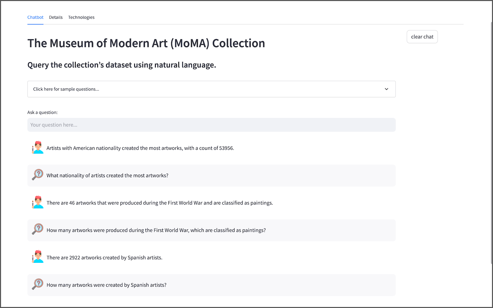
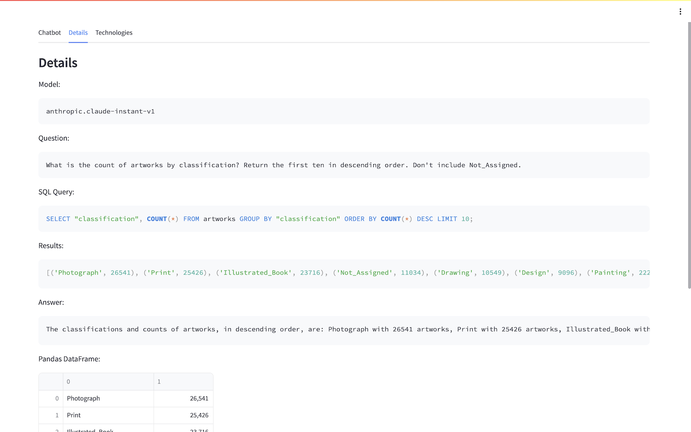

## Generative AI-enabled Natural Language Relational Database Queries

This AWS Solution contain a demonstration Generative AI, specifically, the use of Natural Language Query (NLQ) to ask questions of an Amazon RDS for PostgreSQL database. The solution uses Amazon SageMaker JumpStart Foundation Models, or optionally, OpenAI's Generative Pre-training Transformer (GPT) models via their API. The demonstration's web-based application uses a combination of [LangChain](https://python.langchain.com/docs/get_started/introduction.html), [Streamlit](https://streamlit.io/), [Chroma](https://www.trychroma.com/) and [SentenceTransformers](https://huggingface.co/sentence-transformers/all-MiniLM-L6-v2) to perform NQL based on end-user input.

### NLQ Application Web-based UI



### NLQ Application Verbose Output



## Foundation Model Choice and Accuracy of NQL

The selection of the Foundation Model (FM) for Natural Language Query (NLQ) plays a crucial role in the application's ability to accurately translate natural language questions into natural language answers; not all FMs possess NLQ capabilities. In addition to model choice, accuracy also relies heavily factors such as the quality of the prompt, prompt-template, and labeled sample queries used for in-context learning (also known as few-shot prompting).

The NLQ Application was tested on a large variety of FMs. OpenAI's GPT-3 series `gpt-3.5-turbo` model is capable of accurately answering all sample questions included in the application's web-based UI. OpenAI GPT-3 and GPT-4 series models, like `text-davinci-003` (Legacy), `gpt-3.5-turbo`, and the latest addition, `gpt-4` should be considered current state-of-the-art for NLQ, providing highly accurate responses to a wide range of complex NLQ questions with minimal in-context learning or additional prompt engineering.

NLQ-capable models, such as `google/flan-t5-xxl` and `google/flan-t5-xxl-fp16`, are available through Amazon SageMaker JumpStart Foundation Models. It is important to note that while the `google/flan-t5` series of models are a popular choice for building Generative AI applications, their capabilities for NLQ are limited compared to other commercial models. The demonstration's `google/flan-t5-xxl-fp16` model may fail to return an answer, provide incorrect answers, or cause the JumpStart Foundation Model to experience lengthy timeouts when faced with even moderately complex questions. User are encouraged to test a variety of JumpStart Foundation Models.

### Optional: Switching Foundation Models

You can also replace the default `google/flan-t5-xxl-fp16` JumpStart Foundation Model inference endpoint, deployed using the `NlqSageMakerEndpointStack.yaml` CloudFormation template file. You will first need to modify the model parameters in the `NlqSageMakerEndpointStack.yaml` file and update the deployed CloudFormation stack, `NlqSageMakerEndpointStack`. Additionally, you may need to make adjustments to the `app_sagemaker.py` file, modifying the `ContentHandler` Class to match the response payload of the chosen model. Then, rebuild the Amazon ECR Docker Image, `nlq-genai-1.0.1-sm`, using the `Dockerfile_SageMaker` Dockerfile and push it to the ECR repository. Lastly, you will need to update the deployed ECS task and service, which are part of the `NlqEcsStackSageMaker` CloudFormation stack.

### Optional: Switching to OpenAI

Transitioning from the solution's Amazon SageMaker JumpStart Foundation Models to OpenAI's models via their API is designed to easy. Using a third-party model via an API eliminates the need for the deployment of the `NlqSageMakerEndpointStack` CloudFormation stack. If the stack has already been deployed, it can be deleted. To use OpenAI's API, build the Amazon ECR Docker Image using the `Dockerfile_OpenAI` Dockerfile and push the resulting image, `nlq-genai-1.0.0-oai`, to the ECR repository. Finally, deploy the `NlqEcsOpenAIStack.yaml` CloudFormation template file. To utilize OpenAI's models, you will first need to create an OpenAI account and obtain your own personal secret API key.

## Sample Dataset

This solution uses an optimized copy of the open-source database, The Museum of Modern Art (MoMA) Collection. The MoMA database contains over 121,000 pieces of artwork and 15,000 artists. This project repository contains pipe-delimited text files that can be easily imported in the Amazon RDS for PostgreSQL database instance.

Using the MoMA dataset, we can ask natural language questions, like:

- How many artists are there in the collection?
- How many pieces of artwork are there in the collection?
- How many artists are there whose nationality is Italian?
- How many artworks are by the artist Claude Monet?
- How many artworks are classified as paintings?
- How many artworks were created by Spanish artists?
- How many artist names start with the letter 'M'?
- How many artists are deceased as a percentage of all artists?
- Who is the most prolific artist in the collection? What is their nationality?
- What nationality of artists created the most artworks in the collection?
- What is the ratio of male to female artists. Return as a ratio.
- How many artworks were produced during the First World War, which are classified as paintings?
- What are the five oldest artworks in the collection? Return the title and date for each.
- Return the artwork for Frida Kahlo in a numbered list, including title and date.
- What are the ten artworks by European artist, with a data? Write Python code to output them with Matplotlib as a table. Include header row and font size of 12.
- Give me a recipe for chocolate cake.

Again, the ability of the NLQ Application to return an answer and return an accurate answer, is primarily dependent on the choice of model. Not all models are capable of NLQ, while others will not return accurate answers.

## Deployment Instructions

1. If using Option 1: SageMaker JumpStart FM Endpoint, make you have the required EC2 instance for the endpoint inference, or request it using Service Quotas in the AWS Management Console (e.g., `ml.g5.24xlarge` for the `google/flan-t5-xxl-fp16` model: https://us-east-1.console.aws.amazon.com/servicequotas/home/services/sagemaker/quotas/L-6821867B). Refer to the model's documentation for choice of instance type.
2. Create the required secrets in AWS Secret Manager using the AWS CLI.
3. Deploy the `NlqMainStack` CloudFormation template.
4. If using Option 1: SageMaker JumpStart FM Endpoint, build and push the `nlq-genai:1.0.0-sm` Docker image to the new Amazon ECR repository. Alternately, build and push the `nlq-genai:1.0.0-oai` Docker image for use with Option 2: OpenAI API.
5. Import the included sample data into the Amazon RDS MoMA database.
6. Add the `nlqapp` user to the MoMA database.
7. Deploy the `NlqSageMakerEndpointStack` CloudFormation template, using the Amazon SageMaker JumpStart Foundation Models option.
8. If using Option 1: SageMaker JumpStart FM Endpoint, deploy the `NlqEcsSageMakerStack` CloudFormation template. Alternately, deploy the `NlqOpenAIStack` CloudFormation template for use with Option 2: OpenAI API.

### 2. Create AWS Secret Manager Secrets

Make sure you update usernames and password.

```sh
aws secretsmanager create-secret \
    --name /nlq/MasterUsername \
    --description "Master username for RDS instance." \
    --secret-string "<your_master_username>"

aws secretsmanager create-secret \
    --name /nlq/NLQAppUsername \
    --description "NLQ Application username for MoMA database." \
    --secret-string "<your_nqlapp_username>"

aws secretsmanager create-secret \
    --name /nlq/NLQAppUserPassword \
    --description "NLQ Application password for MoMA database." \
    --secret-string "<your_nqlapp_password>"

# optional for Option 2: OpenAI API/model
aws secretsmanager create-secret \
    --name /nlq/OpenAIAPIKey \
    --description "OpenAI API key." \
    --secret-string "<your_openai_api_key"
```

### 3. Deploy the Main NLQ Stack: Networking, Security, RDS Instance, and ECR Repository

```sh
cd cloudformation/

aws cloudformation create-stack \
  --stack-name NlqMainStack \
  --template-body file://NlqMainStack.yaml \
  --capabilities CAPABILITY_NAMED_IAM \
  --parameters ParameterKey="MyIpAddress",ParameterValue=$(curl -s http://checkip.amazonaws.com/)/32
```

### 4. Build and Push the Docker Image to ECR

You can build the image locally, in a CI/CD pipeline, using SageMaker Notebook environment, or AWS Cloud9.

```sh
cd docker/

# Located in the output from the NlqMlStack CloudFormation template
# e.g. 111222333444.dkr.ecr.us-east-1.amazonaws.com/nlq-genai
ECS_REPOSITORY="<you_ecr_repository>"

aws ecr get-login-password --region us-east-1 | \
	docker login --username AWS --password-stdin $ECS_REPOSITORY

```

Option 1: SageMaker JumpStart FM Endpoint

```sh
TAG="1.0.0-sm"
docker build -f Dockerfile_SageMaker -t $ECS_REPOSITORY:$TAG .
docker push $ECS_REPOSITORY:$TAG
```

Option 2: OpenAI API

```sh
TAG="1.0.0-oai"
docker build -f Dockerfile_OpenAI -t $ECS_REPOSITORY:$TAG .
docker push $ECS_REPOSITORY:$TAG
```

### 5. Import Sample Data and Configure the MoMA Database

1. Connect to the `moma` database using you preferred PostgreSQL tool. You may need to enable `Public access` for the RDS instance temporarily depending on how you connect to the database.

2. Create the two MoMA collection tables into the `moma` database.

```sql
CREATE TABLE public.artists (
	artist_id integer NOT NULL,
	full_name character varying(200),
	nationality character varying(50),
	gender character varying(25),
	birth_year integer,
	death_year integer,
	CONSTRAINT artists_pk PRIMARY KEY (artist_id)
)

CREATE TABLE public.artworks (
	artwork_id integer NOT NULL,
	title character varying(500),
	artist_id integer NOT NULL,
	date integer,
	medium character varying(250),
	dimensions text,
	acquisition_date text,
	credit text,
	catalogue character varying(250),
	department character varying(250),
	classification character varying(250),
	object_number text,
	diameter_cm text,
	circumference_cm text,
	height_cm text,
	length_cm text,
	width_cm text,
	depth_cm text,
	weight_kg text,
	durations integer,
	CONSTRAINT artworks_pk PRIMARY KEY (artwork_id)
)
```

3. Unzip and import the two data files into the `moma` database using the text files in the `/data` sub-directory. The both files contain a header row and pipe-delimited ('|').

```txt
# examples commands from pgAdmin4
--command " "\\copy public.artists (artist_id, full_name, nationality, gender, birth_year, death_year) FROM 'moma_public_artists.txt' DELIMITER '|' CSV HEADER QUOTE '\"' ESCAPE '''';""

--command " "\\copy public.artworks (artwork_id, title, artist_id, date, medium, dimensions, acquisition_date, credit, catalogue, department, classification, object_number, diameter_cm, circumference_cm, height_cm, length_cm, width_cm, depth_cm, weight_kg, durations) FROM 'moma_public_artworks.txt' DELIMITER '|' CSV HEADER QUOTE '\"' ESCAPE '''';""
```

### 6. Add NLQ Application to the MoMA Database

Create the read-only NQL Application database user account. Update the username and password you configured in step 2, with the secrets.

```sql
CREATE ROLE <your_nqlapp_username> WITH
	LOGIN
	NOSUPERUSER
	NOCREATEDB
	NOCREATEROLE
	INHERIT
	NOREPLICATION
	CONNECTION LIMIT -1
	PASSWORD '<your_nqlapp_password>';

GRANT pg_read_all_data TO <your_nqlapp_username>;
```

### 7. Deploy the ML Stack: Model, Endpoint

Option 1: SageMaker JumpStart FM Endpoint

```sh
cd cloudformation/

aws cloudformation create-stack \
  --stack-name NlqSageMakerEndpointStack \
  --template-body file://NlqSageMakerEndpointStack.yaml \
  --capabilities CAPABILITY_NAMED_IAM
```

### 8. Deploy the ECS Service Stack: Task, Service

Option 1: SageMaker JumpStart FM Endpoint

```sh
aws cloudformation create-stack \
  --stack-name NlqEcsSageMakerStack \
  --template-body file://NlqEcsSageMakerStack.yaml \
  --capabilities CAPABILITY_NAMED_IAM
```

Option 2: OpenAI API

```sh
aws cloudformation create-stack \
  --stack-name NlqEcsOpenAIStack \
  --template-body file://NlqEcsOpenAIStack.yaml \
  --capabilities CAPABILITY_NAMED_IAM
```

## Security

See [CONTRIBUTING](CONTRIBUTING.md#security-issue-notifications) for more information.

## License

This library is licensed under the MIT-0 License. See the LICENSE file.

```

```
